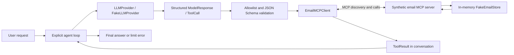

# AI Agent & MCP Showcase

A compact Python showcase of an explicit, controllable agent architecture:
an `LLMProvider` abstraction proposes structured decisions, the agent validates
tool arguments against JSON Schema, and an MCP client/server boundary separates
decisions from execution. Provider iterations and tool calls are bounded, and
all operations use synthetic email in a public-safe, in-memory environment.

This is a portfolio-focused subset inspired by a larger private project. Generic
conversation types, the explicit loop, MCP adapters, store behavior, and focused
test cases were selectively adapted and simplified. It is a **simulated email
environment**, with **no production Gmail integration** and **no real credentials**.
It is not intended as a production email agent.

## What it demonstrates

- An explicit asynchronous Python agent loop with visible execution limits.
- An `LLMProvider` protocol and deterministic `FakeLLMProvider`.
- Client/server separation using the official Python MCP SDK.
- Tool discovery, structured decisions, JSON Schema argument validation, and tool results.
- Isolated synthetic state and automated tests without internet or API keys.

## Design goals

- **Inspectability:** Keep the agent loop, decisions, and tool results easy to follow.
- **Control:** Validate tool requests and enforce explicit execution limits.
- **Separation of concerns:** Give the provider, agent, MCP adapter, and store distinct responsibilities.
- **Reproducibility:** Run deterministic demonstrations and isolated tests without external services.

## Example

> Find the September invoice and label it TO_REVIEW.

The demo takes four provider turns and three tool calls:

```text
1. FakeLLMProvider chooses search_email(query="September invoice")
2. It reads the search result and chooses get_email(message_id="msg-invoice")
3. It reads the email and chooses apply_label(message_id="msg-invoice", label="TO_REVIEW")
4. It reads the successful label result and returns a final answer

Agent: September invoice labeled TO_REVIEW.
Final labels: ['INBOX', 'TO_REVIEW']
```

`FakeLLMProvider` is deliberately deterministic so the demonstration is
reproducible. It exercises the same `LLMProvider` contract a real LLM adapter
would implement, using returned IDs and tool results to propose subsequent
decisions. Its built-in policy supports the example request; scripted responses
allow arbitrary test scenarios through that same contract. It is not a language model.

## Architecture



| Component | Responsibility |
| --- | --- |
| `core.py` | Provider-neutral conversation, tool call, result, and schema dataclasses |
| `agent.py` | Discovers authorized tools, validates decisions, executes the bounded loop |
| `providers/base.py` | Defines the asynchronous `LLMProvider` contract |
| `providers/fake.py` | Proposes deterministic decisions and consumes previous tool results |
| `mcp/client.py` | Wraps SDK discovery/calls and converts results into the core contract |
| `mcp/fake_email_server.py` | Exposes four typed tools through the SDK |
| `mcp/store.py` | Owns synthetic messages, substring search, labels, and archive state |

The demo and tests use the SDK's supported in-memory client/server connection:
real MCP discovery and invocation, with no network listener or subprocess required.
The agent has no store access. Only the server operates on the store. The server
module can also run independently over stdio. See the
[official MCP client documentation](https://py.sdk.modelcontextprotocol.io/client/)
for supported transports.

There is no LangChain or LangGraph because the short loop is the point of the
showcase. Direct Python makes validation, message history, and stopping conditions
visible without framework-specific abstractions.

## Execution and validation

**Maximum per run: 4 provider iterations and 3 tool calls.**

`MAX_AGENT_ITERATIONS = 4` and `MAX_TOOL_CALLS = 3` are defined in `agent.py` and
asserted in tests. Each provider completion consumes one iteration. The fourth
iteration may return a final answer; further tool requests raise `SafetyLimitError`
before execution. Tool calls are counted across all turns, including batches and
calls returning tool errors. A batch exceeding the remaining budget executes at
most that budget, then raises; earlier mutations are not rolled back.

The entire provider decision is checked before its tools execute. Malformed
responses, unknown tools, non-object arguments, missing fields, wrong types, and
extra fields raise `AgentError`. The client adapter tightens discovered schemas to
reject extra fields. The server validates domain rules such as valid message IDs
and non-empty labels. Tool errors return to the provider as structured results.
There is no Python evaluation or shell execution tool.

## Available tools

| Tool | Arguments | Behavior |
| --- | --- | --- |
| `search_email` | `query: str = ""` | Case-insensitive substring search across sender, subject, and body; returns metadata |
| `get_email` | `message_id: str` | Returns a synthetic message including its body and labels |
| `apply_label` | `message_id: str`, `label: str` | Adds a label once; rejects blank, padded, or control-character labels |
| `archive_email` | `message_id: str` | Removes `INBOX` once; preserves other labels |

Both label and archive operations are idempotent. Each new store starts with the
same two synthetic messages, using reserved `example.test` addresses. Changes
live only in memory; there is no database.

## Local setup and run

Requires Python 3.12 or later. From the repository root:

```bash
python3 -m venv .venv
source .venv/bin/activate
python -m pip install -e '.[dev]'
python -m agent_showcase
```

Installing dependencies may require internet. Once installed, the demo and tests
run offline. No environment variables or `.env` file are needed.

To run the standalone synthetic stdio server (optional; stop with Ctrl+C):

```bash
python -m agent_showcase.mcp.fake_email_server
```

## Tests

```bash
python -m pytest -q
```

Tests cover the full search/get/label workflow, four provider iterations, three
executed calls, malformed decisions, unknown tools, argument schemas, structured
server errors, search/get, idempotent mutations, state reset, and defensive copies.
They use the local SDK boundary and require no internet, keys, or production services.

## Scope and limitations

This intentionally small example omits real Gmail APIs, OAuth, real model
providers, persistent history, classification/taxonomy learning, review workflows,
deployment configuration, and production data. It has no dependency on any
private repository. Execution limits bound provider turns and tool count; they
do not impose wall-clock timeouts. There is no general language understanding,
authentication, multi-user isolation, retry policy, or transactional rollback.

The provider interface is an extension point. A real provider would need its own
implementation, response parsing, and operational safeguards; none are required
to understand or run this showcase.

License selection is pending owner review; see [LICENSE.md](LICENSE.md). Confirm
rights and select a public license before publishing.
